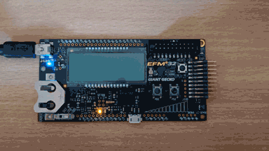

# EFM32GG Blink Example

This crate provides a demo on how to use EFM32 PACs for LED blinking.

### Contribution

Unless you explicitly state otherwise, any contribution intentionally submitted for inclusion in the
work by you, as defined in the BSD-3-Clause license without any additional terms or conditions.